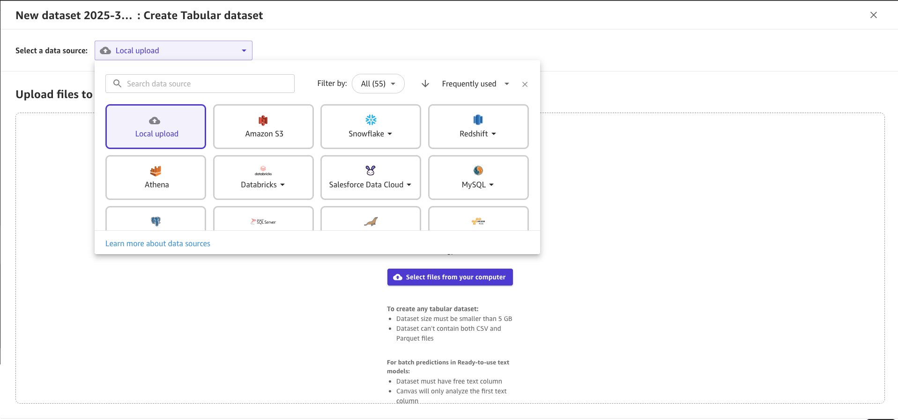
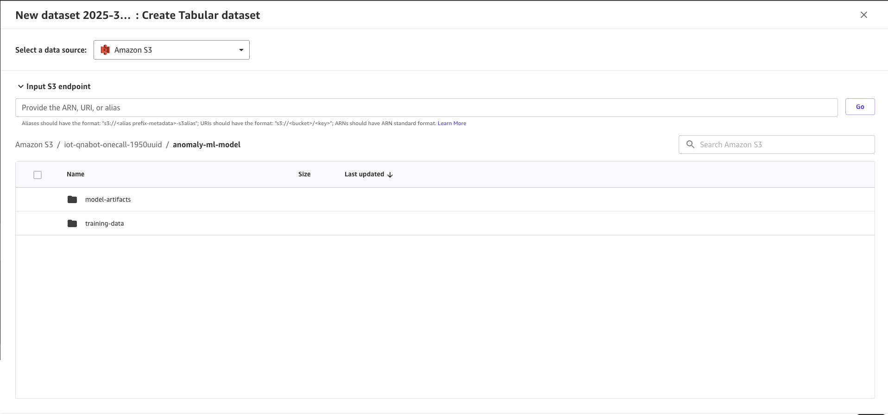

## Train and register the Anomaly Model

Prerequisites

* AWS Console access with appropriate permissions
* Create SageMaker Domain : https://docs.aws.amazon.com/sagemaker/latest/dg/onboard-quick-start.html
* Access to Amazon SageMaker Canvas
* Source data in S3 bucket: s3://iot-qnabot-onecall-XXXXX/anomaly-ml-model/training-data/training_data.csv

Step-by-Step Instructions

### Access SageMaker Canvas

1. Sign in to AWS Management Console
2. Navigate to Amazon SageMaker
3. Click on "Canvas" in the left navigation panel
4. Ensure you select the right SageMaker domain and user profile that was created or edited for this guidance

### Import Training Data

1. In Canvas, in the left panel click the "dataset" button. Click on Import Data button, select Tabular, provide a dataset name ("iot-qnabot-onecall-anomaly-sample-data")
2. 
3. Select "Amazon S3" as your data source

4. Enter the S3 URI: s3://iot-qnabot-onecall-XXXXX/anomaly-ml-model/training-data/. Select training_data.csv. Click on Preview dataset. Once the dataset is shown click on Create dataset. The status of the dataset should change to Ready.
5. In the left panel, click on My Models
6. Click on new model

### New Model Workflow
1. Create New ModelFrom the Canvas dashboard, click "New model" Enter a descriptive name for your modelSelect "Predictive analysis" as the model typeClick "Create"

2. Select your imported dataset. Choose the target column (wattage_mode) for anomaly detection

3. Review the automatically selected features

### Train Model
1. Select build type:Quick build (faster, lower accuracy) Standard build (longer, higher accuracy). We recommend using Standard build for better accuracy.
2. The model building may take ~30 min
3. Monitor the progress indicator
4. Once the model is created, go to My Models in the left menu navigation. Click on the model name. For v1, click 3 dots and Add to Model Registry.
5. Add a model group name and click on Add.
6. Go to SageMaker AI Studio, click on the Models in the left menu navigration. You'll find the Model Group.
7. Click on the Model Group name, select Version 1, click on 3 dots and Edit. In the Model Approval Status, select Approved and Save changes.
8. Select Version 1, click on Deploy, copy the "Model Name". DO NOT deploy the model. Click on Cancel. We are not creating any endpoint as we'll be running the model in batch mode. Model name is required to create the batch inference.

Troubleshooting Common issues and solutions:

    1. Data import fails: Verify S3 permissionsTraining errors: Check data format and completeness

### Output:

* List down the out params from this workflow that’ll be fed to the next workflows. Eg: Model Name

### (Optional) How you can train your own anomaly detection model ? 

Access SageMaker Canvas

    * Log into the AWS Management Console
    * Navigate to Amazon SageMaker
    * Select "Canvas" from the left sidebar

Import Your Data

    * Click "Import" in the Canvas interface
    * Choose your data source (e.g., Amazon S3, local file upload)
    * Select the dataset for anomaly detection
    * Verify data import success 

Create a New Model

    * Click "New model" in the Canvas dashboard
    * Name your model
    * Select "Predictive analysis" as the model type

Configure Model Settings

    * Choose the target column for anomaly detection
    * Select relevant features for the model
    * Adjust any advanced settings if necessary 

Train the Model

    * Click "Train model" to start the training process ; To build your model, you can choose either a Quick build or a Standard build. The Quick build has a shorter build time, but the Standard build generally has a higher accuracy
    * SageMaker Canvas will automatically split the data and train the model
    * Monitor the progress bar for completion 

Review Model Performance

    * Examine the model metrics provided by Canvas
    * Analyze the feature importance to understand key factors 

Generate Predictions

    * Use the "Predict" tab to make predictions on new data
    * Upload a dataset or use a sample for testing
    * Review the anomaly detection results 

Iterate and Refine

    * Based on results, consider adjusting model settings or features
    * Retrain the model if necessary
    * Continuously monitor and update the model as new data becomes available 

Use model

    * Register the model 
    * Update the Processing Lambda with the model ID you trained
    * to list models trained on Canvas you may use this : 

aws sagemaker list-models —query "Models[?contains(ModelName, 'canvas')]"

Key Points and Caveats:

* SageMaker Canvas uses automated machine learning (AutoML) to select the best algorithm for anomaly detection
* The quality of the anomaly detection model depends heavily on the quality and relevance of the input data
* Customers should ensure they have sufficient historical data to train an effective anomaly detection model

