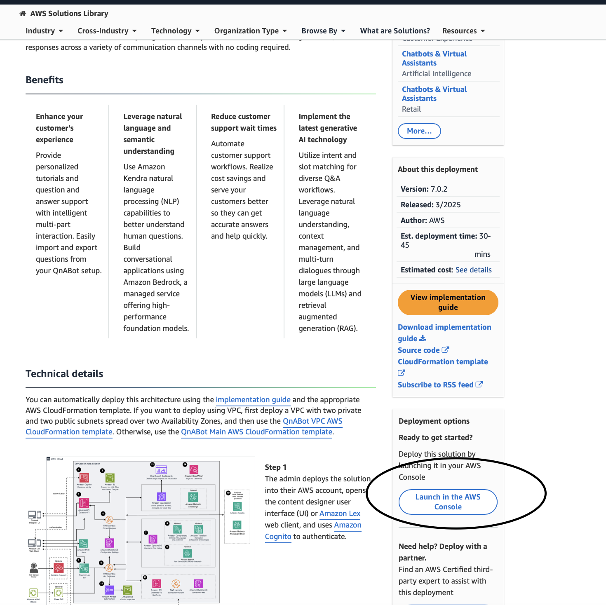
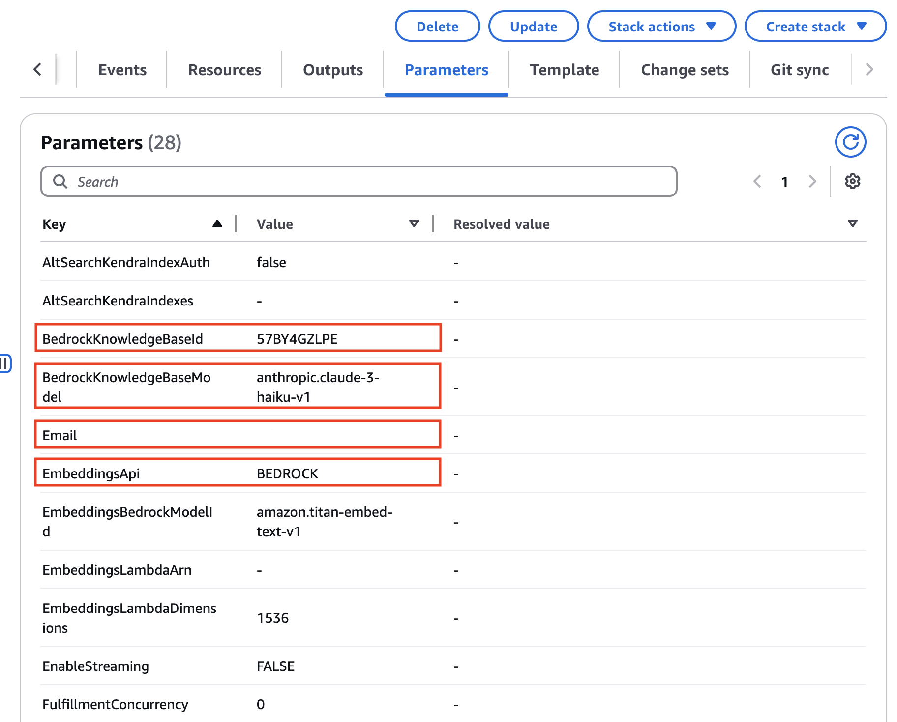
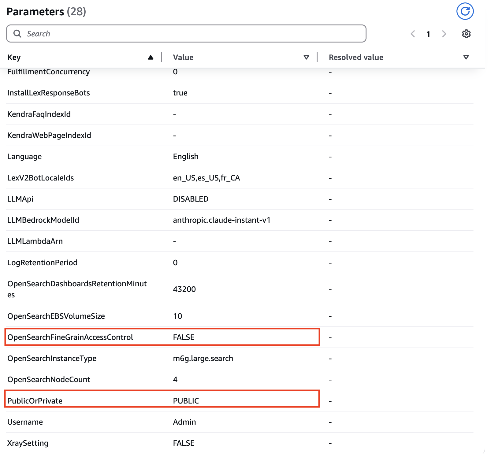
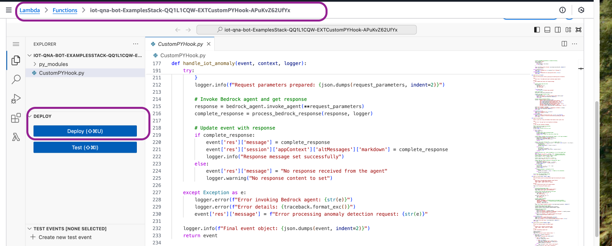

**Prerequisites**:

1. Ensure following [model access](https://docs.aws.amazon.com/bedrock/latest/userguide/model-access-modify.html) in the Amazon Bedrock console: Amazon Titan Embed Text v1, Anthropic Claude Instant v1, Anthropic Claude Haiku 3.0 and Anthropic Claude Sonnet 3.0

Deployment Instructions

**Deploy QnABot and Modify**

1. Deploy the [QnABot solution](https://aws.amazon.com/solutions/implementations/qnabot-on-aws/) from the landing page. Use the launch button in the landing page to start the AWS Cloudformation stack as shown below. For providing the parameter details please see below.

2. Once the cloufromation opens in the console, please select "next to move on to the paramaters page. Here please enter the following:

- Provide a unique stack name.
- Provide your email as the admin for this installation. You can also create additional users in Cognito once the stack is deployed.
- Please obtain the Bedrock knowlegde base ID "iotqnabotonecallkbiotqnabotonecallkbid" from the **Outputs** of the cloudformationstack that you have deployed with the file **iot-qnabot-onecall-agent.yml** to provide as a parameter to the QnABot AWS Cloudformation stack.
- While deploying the cloudformation, plesae ensure that the input parameters match as per the screenshots below. Please note the highlighted parameters. Also change the knowledge base id, created as part of "Deploy Agent Orchestration workflow"

3. Continue to deploy the stack by selecting "Next" and checking the boxes to give permission to create the reousrces.

4. In the console, navigate to Lambda and search for a function by the name "**EXTCustomPYHook**". Copy and paste the code from the file in this [repo](../source/lambda/iot-qnabot-onecall-custom-hook/CustomPYHook.py) to the Lambda function editor. Re-Deploy the lambda function.

5. For the same Lambda function, modify the execution role by giving DynamoDB and Bedrock access

6. For the same Lambda function, add the environment variables as AGENT_ID and AGENT_ALIAS_ID. Get the following input parameters from "Deploy Agent Orchestration workflow": iotqnabotonecallagentid, iotqnabotonecallagentaliasid

7. When QnA Bot stack got deployed successfully, you should have got an email to log in to the QnA Bot Content Design page. Note the password from the email. Go to the Content Design page, you'll find the URL in the CloudFromation output parameter (ContentDesignerURL). The user id is "Admin" and password is shared in the email. You'll be prompted to change the password. Go to the hamburger icon on the top left, and navigate to the Import option. Download the qna.json file, here is the [link](../assets/config/qna.json). Import the file in the Content Designer. You'll see "Complete" status in the Import Jobs.

8. In the QnA Bot Content Designer page, go to the hamburger icon on the top left, and navigate to the Settings option. Scroll down to the end, click on Import Settings. Download the settings.json file, here is the [link](../assets/config/settings.json). Import the file in the Content Designer. You'll see a success message.

**Deploy Lex Web UI [Optional]**

1. Deploy the following stack so that there is a UI for the Lex agent. https://github.com/aws-samples/aws-lex-web-ui

2. Provde agent ID and alias as parameters to the Cloudformation stack.

Note: To change the UI and make modifications please use the .html file in the S3 bucket and provide it as the parameter in the Lex Web UI cloudformation stack.
