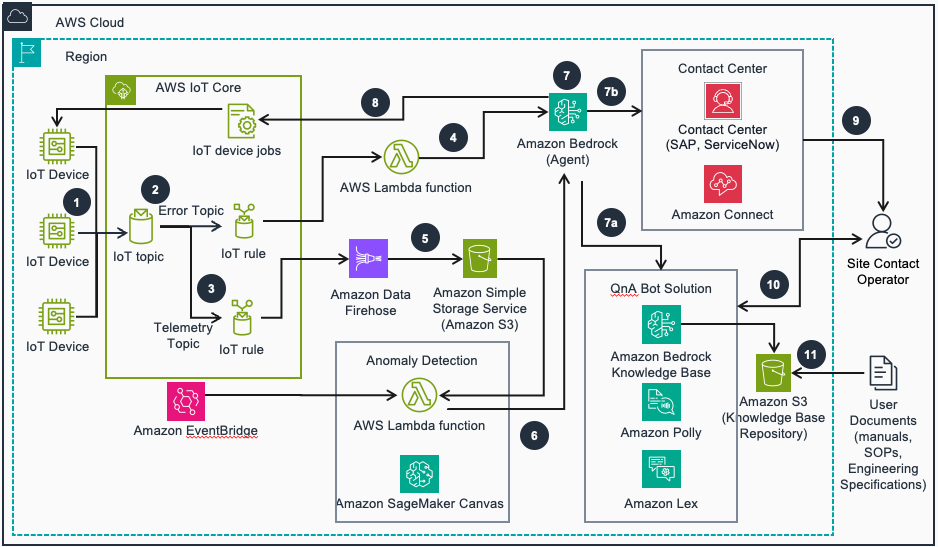

# Guidance for Connecting Automated Inputs to Contact Centers on AWS

This Guidance shows how to connect automated data sources to contact center systems. These sources could include Internet of Things (IoT) devices, interactive voice response (IVR) systems, customer relationship management (CRM) alerts, and automated quality monitoring tools. IoT integration enables three key benefits: real-time detection of errors and anomalies, automated incident resolution, and direct integration with omni-channel contact centers. Using artificial intelligence (AI), this workflow reduces average response time and helps to resolves common issues without human intervention.

## Table of Contents

### Required

1. [Overview](#Overview)
   - [Cost](#Cost)
2. [Prerequisites](#Prerequisites)
   - [Operating System](#Operating-System)
3. [Deployment Steps](#Deployment-Steps)
4. [Deployment Validation](#Deployment-Validation)
5. [Running the Guidance](#Running-the-Guidance)
6. [Next Steps](#Next-Steps)
7. [Cleanup](#Cleanup)
8. [Revisions](#Revisions)
9. [Notices](#Notices)
10. [Authors](#Authors)

## Overview

This Guidance shows how to connect automated data sources to contact center systems. These sources could include Internet of Things (IoT) devices, interactive voice response (IVR) systems, customer relationship management (CRM) alerts, and automated quality monitoring tools. IoT integration enables three key benefits: real-time detection of errors and anomalies, automated incident resolution, and direct integration with omni-channel contact centers. Using artificial intelligence (AI), this workflow reduces average response time and helps to resolve common issues without human intervention.



The architecture can be broadly divided into 5 workflows:

- 1/ IoT Telemetry workflow
- 2/ Error & Anomaly workflow
- 3/ Agent Orchestration
- 4/ Contact Center workflow
- 5/ QnA Chat Bot

The workflows are illustrated below:

### 1/ IoT Telemetry workflow

IoT devices are setup along with the simulator to publish telemetry data in IoT Core

**Components**

- **Amazon EC2**

  - The IoT device simulator service runs on an EC2 instance to publish the telemetry data

- **AWS IoT Core**

  - IoT devices are managed in AWS IoT Core

- **AWS IoT Rule**
  - IoT Rules are part of AWS IoT Core service.
  - There are two IoT Rules:
    - 1/ if there is any error it invokes a Lambda function (iot-qnabot-onecall-error-handler) with error details,
    - 2/ telemetry data is sent to Amazon Data Firehose

### 2/ Error & Anomaly workflow

IoT telemetry data is processed by streaming data processing pipelines. If errors are emitted by the IoT devices Bedrock agent is invoked to take actions as described in the Troubleshooting guide in the Knowledge Base. Telemetry data is processed to detect any anomalies using ML models in Sagemaker. Bedrock agent is invoked when anomalies are found. Bedrock agent finds possible resolution for the anomalies from knowledge bases and notifies the contact center with relevant information.

**Components**

- **AWS Lambda function - iot-qnabot-onecall-error-handler**

  - Invokes Bedrock agent with relevant details if any error is emitted by the IoT device

- **Amazon Data Firehose**

  - Streams IoT telemetry data from devices

- **Amazon SageMaker Canvas**

  - It is used to train the ML model to delect anomaly

- **AWS Lambda function - iot-qnabot-onecall-anomaly-inference**

  - Processes all telemetry data in S3 for a provided look back period to create features for anomaly detection model
  - Writes processed data back to S3
  - Triggers Sagemaker batch transform for running inference on processed data

- **AWS Lambda function - iot-qnabot-onecall-inference-processor**

  - Processes anomaly model detection inference output
  - Writes processed inference output as CSV files to S3

- **AWS Lambda function - iot-qnabot-onecall-anomaly-handler**
  - Reads inference output from S3 for a provided look back period
  - Invokes Bedrock agent with relevant details if any anomalies were identified by ML model

### 3/ Agent Orchestration

Bedrock agent can recieve 3 types of requests: 1/ ask to take action when error is emitted by a device, 2/ ask to take action when anomaly is detected, 3/ answer user queries about the error, anolamly or telemetry data

**Components**

- **Amazon Bedrock Agent**

  - Bedrock agent has a Knowldege Base and 2 action groups
  - The Knowledge Base contains the Troubleshooting guide. It has the error details, troubleshooting steps, actions by individual error or anomaly
  - One of the action groups takes actions based on the error or anomaly
  - The other action groups responds to user queries

- **AWS Lambda function - iot-qnabot-onecall-triage**

  - It can take 3 actions based on the ask:
    - 1/ log ticket in the error table in DynamoDB, sends email to the user
    - 2/ call the Amazon Connect Contact Flow to initiate a voice call to the site operator
    - 3/ call AWS IoT Core and publish a message to clear the fault

- **AWS Lambda function - iot-qnabot-onecall-user-query**

  - It can take 2 actions based on the ask:
    - 1/ fetch ticket data from the error table in DynamoDB
    - 2/ fetch telemetry data from the S3 bucket

- **Amazon Bedrock KnowledgeBase**
  - It stores the embeddings for the Troubleshooting doc
  - It uses OpenSearch Serverless vector DB

### 4/ Contact Center workflow

Contact Center workflow is used to contact the site operators in case of high priority errors so that site operator can take necessary actions

**Components**

- **Amazon Connect Instance**

  - Connect instance with Instance alias configurable through parameters

- **Contact Flow**

  - Initiates outbound outbound voice call to the site operator
  - Includes flow logging
  - Handles automated threshold violation notifications
  - Contains message participant and disconnect actions

- **Phone Number**
  - Provisions a DID (Direct Inward Dialing) phone number
  - Region: United States (+1)
- **Hours Of Operation**

  - Name: Business Hours
  - Configured for 24/7 operation
  - Time Zone: America/New_York
  - Covers all days of the week (Monday through Sunday)
  - Operating hours: 00:00 to 23:59 daily

- **Queue**
  - Creates a basic queue for call handling
  - Links to the 24/7 hours of operation
  - Configurable queue name through parameters

### 5/ QnA Chat Bot

Site operator interacts with the QnA Chat Bot to find the device details, error or anamaly information and telemetry data

**Components**

Please refer to the QnA Bot [guidance](https://aws.amazon.com/solutions/implementations/qnabot-on-aws/) for all the components. For this guidance following are the prevalent components:

- **Amazon Lex**

  - It provides the chat interface for the user

- **Amazon DynamoDB**

  - Device dimension and error data are stored in the Dynamo DB tables

- **Amazon Bedrock Knowledge Base**
  - Troubleshooting guide is stored in the Knowledge Base

### Cost

_You are responsible for the cost of the AWS services used while running this Guidance. As of Apr, 2025, the cost for running this Guidance with the default settings in the US East (N. Virginia) AWS Region is approximately $1,470 per month._

Assumptions:

- Region = us-east- 1
- IoT Devices = 4
- Number of messages per device per min = 1
- Error per device per month = 8
- No of calls/month = 30

The following table provides a sample cost breakdown for deploying this Guidance with the default parameters in the US East (N. Virginia) Region for one month.

| AWS service                  | Dimensions                                                                                                                                                                        | Cost/Month [USD] |
| ---------------------------- | --------------------------------------------------------------------------------------------------------------------------------------------------------------------------------- | ---------------- |
| AWS IoT Core                 | 4 devices, 43200 messages per device per month, 1 KB message size, 2 rules - one for telemetry, one for error flow                                                                | $ 0.24           |
| Amazon EC2                   | 1 t4g.nano instance to run the IoT simulator                                                                                                                                      | $ 3.87           |
| AWS Lambda                   | 10,000 requeste per month, average duration per invocation 1 min                                                                                                                  | $ 5.00           |
| Amazon Data Firehose         | 4 records per min for ingestion, 1 KB message size                                                                                                                                | $ 0.02           |
| Amazon S3                    | 1 GB per month S3 standard storage                                                                                                                                                | $ 1.06           |
| Amazon SageMaker Canvas      | Custom model training job for tabular data                                                                                                                                        | $ 10.00          |
| Amazon SageMaker             | 720 batch transform jobs per month, 10 min per job, ml.m5.xlarge instance                                                                                                         | $ 33.12          |
| Amazon OpenSearch Serverless | Bedrock KB, 1 Indexing OCU, 1 Search and Query OCU, 1 GB data                                                                                                                     | $ 350.42         |
| Amazon DynamoDB              | 100 writes and 100 reads per day                                                                                                                                                  | $ 0.25           |
| Amazon Bedrock               | Bedrock Agent cost for 150 agentic flow per month, 5 invoke model (Anthropic Claude Sonnet 3) calls per agentic flow, input token = 62,500 and output tokens = 20,000 per call    | $ 0.25           |
| Amazon Connect               | 1 DID Phone Number, Outbound call duration = 1 minute                                                                                                                             | $ 2.50           |
| QnA Bot                      | Refer to [QnA Bot estimate](https://docs.aws.amazon.com/solutions/latest/qnabot-on-aws/cost.html), considered default basic deployment and Bedrock for text embedding and LLM Q&A | $ 696.06         |
| **Total Cost**               |                                                                                                                                                                                   | **$ 1468.17**    |

## Prerequisites

### Operating System

- This guidance was tested in [Cloudshell](https://aws.amazon.com/cloudshell/?trk=59bef63e-74bc-4cc2-94dc-31f3ce8c0a3f&sc_channel=ps&ef_id=CjwKCAjw-qi_BhBxEiwAkxvbkFsHTME1XyAiVthymCc4JxSubpDYrc9yB4XRviy_CojUJriaOcBkQRoCNvUQAvD_BwE:G:s&s_kwcid=AL!4422!3!658520965826!!!g!!!19852661720!149878722460&gbraid=0AAAAADjHtp9XzLYAuuCtgwfxbL_waFjjr&gclid=CjwKCAjw-qi_BhBxEiwAkxvbkFsHTME1XyAiVthymCc4JxSubpDYrc9yB4XRviy_CojUJriaOcBkQRoCNvUQAvD_BwE) and EC2 instance.

### Third-party tools (If applicable)

The third party packages used are listed in [here](source/iot_simulator/requirements.txt)

### AWS account requirements (If applicable)

- Amazon Bedrock Model access needs to be enabled. Also the AWS cli needs to be configured in the env. you are using.

### Supported Regions (if applicable)

The guidance code was tested in us-east-1. You can deploy this guidance in regions where all teh services used in the architecture are available. You can check for availability here. https://aws.amazon.com/about-aws/global-infrastructure/regional-product-services/

## Deployment Steps

### Clone the Repo and setup Source Bucket

1. Open CloudShell. Git Clone the repository.
2. Go to the repo dir. Run setup-script.sh:

- `chmod +x setup-script.sh`
- `./setup-script.sh`

3. If the script has run successfully you'll get a message as: "SUCCESS: Following S3 bucket is created and deployment files are uploaded: iot-qnabot-onecall-$uuid". $uuid will have a unique id value. Please note the S3 bucket name.
4. Go to S3 console and check the "iot-qnabot-onecall-$uuid" bucket. It should have the following structure:

```
iot-qnabot-onecall-$uuid/
├── anomaly-ml-model/
│   ├── model-artifacts/
│   └── training-data/
├── deployment/
│   ├── cfn_script/
│   └── source/
│       ├── iot_simulator/
│       └── lambda/
├── knowledge-base/
└── telemetry/
    ├── aggregated-telemetry/
    ├── firehose-streaming-data/
    ├── inference-output/
    └── processed-output/
```

5. anomaly-ml-model prefix contains training-data prefix, which contains the training_data.csv file used for anomaly model training
6. deployment prefix contains CloudFormation scripts and lambda function scripts
7. knowledge-base prefix contains troubleshooting guide used by Bedrock Knowledge Base
8. telemetry prefix is used to store raw, intermediate and processed telemetry data

### Train and register the Anomaly Model

**Prerequisites**

- You need a Amazon Sagemaker AI domain to build Anomaly model using Sagemaker Canvas.

- Check this quick start [guide](https://docs.aws.amazon.com/sagemaker/latest/dg/onboard-quick-start.html) if you need a new Sagemaker AI domain. The domain set up may take 10-15 minutes.

- For existing Sagemaker AI domains, check [this guide](https://docs.aws.amazon.com/sagemaker/latest/dg/canvas-getting-started.html) to enable Sagemaker Canvas

#### Train and Deploy new model

Please see the instructions [here](/Instructions/Anomaly_readme.md)

### Deploy Contact Center workflow

- **Steps to Follow**

  - Navigate to AWS CloudFormation in your AWS Console
  - Create a new stack using the template named [iot-qnabot-onecall-connect.yml](deployment/iot-qnabot-onecall-connect.yml)
  - Provide values for the InstanceAlias and QueueName parameters
  - Review and create the stack

- **Outputs**

  - ConnectInstanceAccessURL
  - ConnectInstanceId
  - ContactFlowId
  - SourcePhoneNumber
  - PhoneNumberId

- **Setup Email Domain**

  - Go to the Amazon Connect Console. Select the instance created. On the left menu navigation, got Email option under Channels and communications.
  - Click on Create a Service Role. Then click on Add Domain.
  - A Domain name will be auto-generated, copy the "Domain name" and click on Add.
  - Go to Amazon Simple Email Service (SES) page and request [production access](https://docs.aws.amazon.com/ses/latest/dg/request-production-access.html)

- **Associate Phone Number**

  - After the CloudFormation template is run, launch AWS Cloudshell and run the following CLI script to associate the phone number with the contact flow.

  `aws connect associate-phone-number-contact-flow --phone-number-id  <PhoneNumberId> --instance-id <ConnectInstsanceId> --contact-flow-id <ContactFlowID>   --region <region name>`

### Deploy IoT Telemetry workflow

- To deploy the IOT simulator, please read the instructions in the [readme](source/iot_simulator/README.md).
- Make a note of the IOT Endpoint.

### Deploy Agent Orchestration workflow

- Enable LLM model access in the AWS Console for the following models: Amazon Titan Embed Text v1, Anthropic Claude Instant v1 and Anthropic Claude Sonnet 3.0
- Deploy the `iot-qnabot-onecall-agent.yml` CloudFormation [template](deployment/iot-qnabot-onecall-agent.yml)
- Provide the following input parameters:
  - ConnectInstanceAccessURL, ConnectInstanceId, ContactFlowId, SourcePhoneNumber --> get the values from "Deploy Contact Center workflow" output
  - Provide your phone number with country code (eg: +1 for US) as DestinationPhoneNumber
  - Provide your email address as RecipientEmailID
  - Provide IOT Endpoint noted in "Deploy IoT Telemetry workflow" as IOTDataEndpoint
  - Provide S3 bucket created as S3DeploymentBucket
- Once the CloudFormation template is deployed, go to Amazon Bedrock Console. Navigate to Knowledge Bases under Builder tools in the left menu. Select the "iot-qnabot-onecall-kb" Knowledge Base.
- Under Data source select "iot-qnabot-onecall-data-source" and click on "Sync". Once sync is complete, Status will show available and Last sync time will show the sync date and time.

### Deploy Error & Anomaly workflow

- Deploy the `iot-qnabot-onecall-anomaly-workflow.yml` cloudformation [template](deployment/iot-qnabot-onecall-anomaly-workflow.yml)
- Provide the following input parameters:
  - Provide S3 bucket created as S3DeploymentBucket
  - Get the following input parameters from "Deploy Agent Orchestration workflow": BedrockAgentAliasId, BedrockAgentId
  - Get the following input parameters from "Train and register the Anomaly Model" workflow: AnomalyDetectionModelName
- Optional inputs
  - TelemetryAnomalyThreshold. Default is 30
  - TelemetryEvaluationPeriodHours. Default is 1
- The stack deploys
  - Firehose data streams for telemetry data and the IOT rules for it.
  - Lambda functions for firehose data processing and anomaly detectiong jobs
  - Lambda functions for error and anomaly handling
  - Related roles and event bridge rules
- Outputs from the template
  - Firehose stream name and ARN - IotQnabotOnecallTelemetryFirehoseStreamName, IotQnabotOnecallTelemetryFirehoseStreamARN
  - Error handler lambda function ARN - IotQnaBotOnecallErrorHandlerLambdaArn
  - Anomaly handler lambda function ARN - IotQnabotOnecallAnomalyHandlerLambdaArn
  - Anomaly inference lambda function ARN - IotQnabotOnecallAnomalyInferenceLambdaArn
  - Inference output cleaup lambda function ARN - IotQnabotOnecallCleanInferenceOutputLambdaArn
- Add event configuration to S3 bucket to trigger Inference output cleanup lambda function when Anomaly inference jobs completes successfully

`aws s3api put-bucket-notification-configuration --bucket <REPLACE WITH S3 DEPLOYMENT BUCKET NAME> --notification-configuration '{"LambdaFunctionConfigurations": [{"LambdaFunctionArn": “<REPLACE WITH INFERENCE OUTPUT CLEANUP LAMBDA FUNCTION ARN>”,”Events": ["s3:ObjectCreated:*"], "Filter": {"Key":{"FilterRules":[{"Name":"prefix","Value":"telemetry/inference-output/"},{"Name":"suffix","Value”:”.out"}]}}}]}`

### Deploy QnA Chat Bot workflow

To deploy the QnABot chat experience please follow the [instructions](Instructions/QnABot_readme.md)

## Deployment Validation

- In the console make sure that all the cloudformation stacks have been deployed successfully.

## Running the Guidance

### Run Error flow

- Inject error in MQTT Client
- Review the Knowledge Base (KB) for the actions
- Ensure the actions are taken as mentioned in the KB: a/ review the ticket in DynamoDB table, b/ review the email, c/ recieve a call (if it's instructed in the KB), d/ clear the fault in IoT Core device shadow (if it's instructed in the KB)

### Run Anomaly flow

- Inject anomaly in MQTT Client
- Wait for an hour
- Review the Knowledge Base (KB) for the actions
- Ensure the actions are taken as mentioned in the KB: a/ review the ticket in DynamoDB table, b/ review the email, c/ recieve a call (if it's instructed in the KB)

### Run queries against the QnA Bot

- Open the QnA Bot interface
- Ask question about a device: "Please tell me about the device aircon_1"
- Ask question about an error: "Please tell me about the error W1"
- Ask question about anomaly details: "Please tell me about the device $device_id, unique id $unique_id"
  - _Replace $device_id and $unique_id with actual values retrieved from the device error table in DynamoDB or email_

## Next Steps

1. If you want, you can integrate your existing anomaly setup with the solution.

## Cleanup

1. Delete the files and S3 bucket. Open Cloudshell. Go to the cloned repo and run cleanup-script.sh. PLEASE ENSURE TO REPLACE $bucket-name WITH THE SOURCE S3 BUCKET NAME:

- `./cleanup-script.sh $bucket-name`

2. Delete the repo dir from the Cloudshell environment

3. Make sure the Amazon SagemMaker Canvas model is deleted.

4. Make sure that the IOT devices created using the simulator are deleted.

5. Make sure all the deployed cloudformation stacks are deleted.

## Revisions

[V1.0] Initial repository release.

## Notices

_Customers are responsible for making their own independent assessment of the information in this Guidance. This Guidance: (a) is for informational purposes only, (b) represents AWS current product offerings and practices, which are subject to change without notice, and (c) does not create any commitments or assurances from AWS and its affiliates, suppliers or licensors. AWS products or services are provided “as is” without warranties, representations, or conditions of any kind, whether express or implied. AWS responsibilities and liabilities to its customers are controlled by AWS agreements, and this Guidance is not part of, nor does it modify, any agreement between AWS and its customers._

## Authors

Brandon Tyler\
Debaprasun Chakraborty\
Deepika Suresh\
Dinesh Ambu\
Judith Joseph\
Santosh Sampras\
Satveer Khurpa\
Steve Krems\
Sushma Gopalakrishnan\
Wael Dimassi
