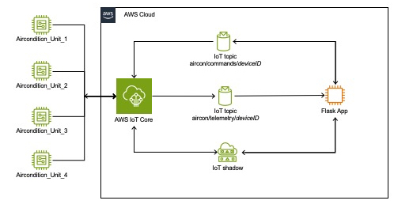

# **Air Conditioner Simulator Project**

## The Air Conditioner Simulator Project is an IoT simulation that models air conditioner units and allows you to monitor and control them via a web dashboard. The project uses AWS IoT Core to simulate device connectivity and messaging.

## Architecture


## **Table of Contents**

* Overview
* Features
* Architecture
* Prerequisites
* Setup Instructions
    * 1. Clone the Repository
    * 2. Install Dependencies
    * 3. AWS Setup
        * 3.1 Configure AWS Credentials
        * 3.2 Create IoT Devices
    * 4. Run the Device Simulators
    * 5. Run the Web Application
* Usage
    * Web Dashboard
    * Device Control
* Project Structure
* Code Overview
    * aircon_simulator.py
    * aircon_dashboard/application.py
    * send_command.py
    * cleanup_device.py
    * aircon_dashboard/templates/index.html
* Cleanup
* Conclusion
* Appendix
    * Complete ``requirements``.txt``

* * *

## **Overview**

## The Air Conditioner Simulator Project simulates multiple air conditioner units, allowing you to monitor their performance and control their settings via a web dashboard. The simulators send telemetry data to AWS IoT Core, and the web application retrieves this data to display on the dashboard.

## **Features**

* Simulate multiple air conditioner units.
* Monitor real-time telemetry data, including temperatures, humidity, power consumption, and more.
* Control device settings such as setpoint temperature and mode.
* Inject and clear faults for testing purposes.
* Manage filter status and reset runtime hours via the GUI or command-line script.
* Devices automatically change filter status to "Needs Cleaning" after 500 hours of runtime.
* Web dashboard with real-time updates.
* **Automated cleanup** of AWS IoT resources using `cleanup_device.py`.

## **Architecture**

1. **Device Simulators (`aircon_simulator.py`):**

    * Simulate air conditioner units.
    * Publish telemetry data to AWS IoT Core.
    * Update device shadows with the reported state.
    * Subscribe to command topics to receive control messages.

1. **Web Application (`aircon_dashboard/application.py`):**

    * Provides a web dashboard to monitor and control devices.
    * Retrieves device data from AWS IoT Core.
    * Sends commands to devices via AWS IoT Core.

1. **Command-Line Tool (`send_command.py`):**

    * Allows sending commands to devices directly from the command line.
    * Supports actions like injecting faults, updating filter status, and resetting runtime hours.

1. **AWS IoT Core:**

    * Serves as the message broker between devices and the web application.
    * Manages device shadows for maintaining device state.

## **Prerequisites**

* Python 3.7 or higher.
* AWS account with permissions to use AWS IoT Core.
* AWS CLI installed and configured.
* `pip` for installing Python packages.

## **Setup Instructions**

### **1. Clone the Repository**

### Clone the project repository to your local machine:

```
bash

git clone https://gitlab.aws.dev/aws-iot-sa/iot_aircon_simulator
```

### **2. Install Dependencies**

### Create a virtual environment and install the required packages:

```
bash

python -m venv venvsource venv/bin/activate  # On Windows: venv\Scripts\activate
pip install -r requirements.txt
```

### **3. AWS Setup**

#### **3.1 Configure AWS Credentials**

#### Ensure your AWS CLI is configured with credentials that have permissions for AWS IoT Core:

```
bash

aws configure
```

#### **3.2 Create IoT Devices**

#### Run the `create_devices.py` script to create the IoT things, certificates, and policies:

```
bash

python create_devices.py
```

This script will:

* Create two IoT things: `air_condition_unit_1` and `air_condition_unit_2`.
* Generate and attach certificates and policies.
* Save device information in the `devices` folder.

### **4. Run the Device Simulators**

### Start the air conditioner device simulators:

```
bash

python aircon_simulator.py
```

This script will:

* Simulate the devices in the `devices` folder.
* Connect each device to AWS IoT Core.
* Publish telemetry data at regular intervals.
* Update device shadows with reported states.
* Subscribe to command topics for receiving control messages.

### **5. Run the Web Application**

### In a new terminal window (with the virtual environment activated), navigate to the `aircon_dashboard` folder and run the web application:

```
bash

cd aircon_dashboard
python application.py
```

This script will:

* Start a Flask web server.
* Provide a web dashboard at `http://127.0.0.1:5000/`.
* Fetch device data from AWS IoT Core.
* Allow you to control devices via the GUI.

* * *

## **Usage**

### **Web Dashboard**

### Access the web dashboard by navigating to:

```
arduino

http://127.0.0.1:5000/


```

The dashboard displays:

* **Device Metrics:**
    * Indoor and outdoor temperatures.
    * Setpoint temperature.
    * Mode (cool, off, fan_only).
    * Humidity levels.
    * Power consumption.
    * Compressor status.
    * Fan speed.
    * Refrigerant pressure.
    * Error codes.
    * **Filter Status** (Clean, Needs Cleaning, Replace).
    * **Runtime Hours**.

### **Device Control**

### For each device, you can:

1. **Update Desired State:**

    * Change the setpoint temperature and mode.
    * Submit the updated desired state to the device shadow.

1. **Fault Injection:**

    * Inject faults (high temperature, low pressure, compressor failure).
    * Clear faults.

1. **Filter Actions:**

    * Set the filter status (Clean, Needs Cleaning, Replace).
    * Reset runtime hours.

### **Command-Line Control with `send_command.py`**

### In addition to the web dashboard, you can control devices using the `send_command.py` script or MQTT commands.

* * *

## **Project Structure**

```
vbnet

aircon-simulator/
├── aircon_simulator.py
├── aircon_dashboard/
│   ├── application.py
│   ├── templates/
│   │   └── index.html
├── send_command.py
├── cleanup_device.py
├── create_devices.py
├── devices/
│   ├── air_condition_unit_1/
│   │   ├── device_info.json
│   │   ├── air_condition_unit_1-certificate.pem.crt
│   │   ├── air_condition_unit_1-private.pem.key
│   │   └── air_condition_unit_1-public.pem.key
│   └── air_condition_unit_2/
│       ├── device_info.json
│       ├── air_condition_unit_2-certificate.pem.crt
│       ├── air_condition_unit_2-private.pem.key
│       └── air_condition_unit_2-public.pem.key
├── requirements.txt
└── README.md
```

* * *

## **Code Overview**

### **`aircon_simulator.py`**

### This script simulates the air conditioner devices.

### **Key Features:**

* **Simulation of Device Metrics:**
    * Generates realistic telemetry data.
    * Tracks runtime hours and updates filter status after 500 hours.
* **MQTT Client:**
    * Connects to AWS IoT Core using MQTT over TLS.
    * Publishes telemetry data to `aircon/telemetry` topic.
    * Publishes error codes to `aircon/errors` topic.
    * Updates device shadows.
* **Command Handling:**
    * Subscribes to `aircon/commands/{device_name}` topic.
    * Handles actions:
        * `inject_fault`
        * `clear_fault`
        * `update_filter_status`
        * `reset_runtime`

**Usage:**

```
bash

python aircon_simulator.py
```

### **`aircon_dashboard/application.py`**

### This Flask web application provides a dashboard to monitor and control devices.

### **Key Features:**

* **Web Dashboard:**
    * Displays real-time device metrics.
    * Allows control of devices via forms.
* **MQTT Client:**
    * Subscribes to `aircon/telemetry` topic.
    * Uses AWS IoT SDK's MQTT client with WebSocket.
* **Device Control Routes:**
    * `update_shadow`: Updates the desired state of a device.
    * `inject_fault`: Injects a fault into a device.
    * `update_filter_status`: Sets the filter status of a device.
    * `reset_runtime`: Resets the runtime hours of a device.

**Usage:**

```
bash

cd aircon_dashboard
python application.py
```

### **`send_command.py`**

### This script allows you to send commands directly to the devices from the command line.

### **What the Script Does:**

* **Sends MQTT Commands:**
    * Publishes messages to the `aircon/commands/{device_name}` topic.
* **Supports Multiple Actions:**
    * `inject_fault`: Injects a specified fault into the device.
    * `clear_fault`: Clears any active faults on the device.
    * `update_filter_status`: Updates the filter status of the device.
    * `reset_runtime`: Resets the runtime hours of the device.

**Command-Line Arguments:**

* `--device-name`: (Required) Name of the device.
* `--action`: (Required) Action to perform. Choices: `inject_fault`, `clear_fault`, `update_filter_status`, `reset_runtime`.
* `--fault-type`: Type of fault to inject. Choices: `high_temperature`, `low_pressure`, `compressor_failure`.
* `--filter-status`: Filter status to update. Choices: `Clean`, `Needs Cleaning`, `Replace`.
* `--endpoint`: (Required) AWS IoT endpoint.
* `--root-ca`: (Required) Path to the root CA certificate.
* `--cert`: (Required) Path to the client certificate.
* `--key`: (Required) Path to the private key.

**Usage Examples:**

1. **Inject a Fault:**

```
bash

python send_command.py \
    --device-name air_condition_unit_1 \
    --action inject_fault \
    --fault-type high_temperature \
    --endpoint <your-iot-endpoint> \
    --root-ca AmazonRootCA1.pem \
    --cert devices/air_condition_unit_1/air_condition_unit_1-certificate.pem.crt \
    --key devices/air_condition_unit_1/air_condition_unit_1-private.pem.key
```

1. **Clear Faults:**

```
bash

python send_command.py \
    --device-name air_condition_unit_1 \
    --action clear_fault \
    --endpoint <your-iot-endpoint> \
    --root-ca AmazonRootCA1.pem \
    --cert devices/air_condition_unit_1/air_condition_unit_1-certificate.pem.crt \
    --key devices/air_condition_unit_1/air_condition_unit_1-private.pem.key
```

1. **Update Filter Status:**

```
bash

python send_command.py \
    --device-name air_condition_unit_1 \
    --action update_filter_status \
    --filter-status "Needs Cleaning" \
    --endpoint <your-iot-endpoint> \
    --root-ca AmazonRootCA1.pem \
    --cert devices/air_condition_unit_1/air_condition_unit_1-certificate.pem.crt \
    --key devices/air_condition_unit_1/air_condition_unit_1-private.pem.key
```

1. **Reset Runtime Hours:**

```
bash

python send_command.py \
    --device-name air_condition_unit_1 \
    --action reset_runtime \
    --endpoint <your-iot-endpoint> \
    --root-ca AmazonRootCA1.pem \
    --cert devices/air_condition_unit_1/air_condition_unit_1-certificate.pem.crt \
    --key devices/air_condition_unit_1/air_condition_unit_1-private.pem.key
```

**Note:**

* Replace `<your-iot-endpoint>` with your AWS IoT endpoint (e.g., `a3k7odshaiipe8-ats.iot.us-east-1.amazonaws.com`).
* Ensure that you have the correct paths to the certificates and keys.

**Usage:**

```
bash

python send_command.py --help


```

This will display the help message with all available options.


### **Using the AWS IoT MQTT Test Client**

1. **Open AWS IoT Core Console**

    * Navigate to the AWS IoT Core service in the AWS Management Console.

1. **Access MQTT Test Client**

    * Click on "Test" in the left navigation pane.

1. **Publish a Command to Inject a Fault**

    * **Topic:** `aircon/commands/air_condition_unit_1`


* **Injecting Fault Codes using MQTT**
* The device simulators subscribe to the MQTT topic `aircon/commands/{device_name}` to receive commands. You can inject or clear faults by publishing JSON messages with the following structure:
* **Fault Injection Commands:**
* **High Temperature Fault Injection**
    * **JSON Payload:**
    * json
        Copy
        {
        "action": "inject_fault",
        "fault_type": "high_temperature"
        }
        
    * *Description:* Increases the indoor temperature by 5–10°C and sets the error code to `"E1"`.
* **Low Pressure Fault Injection**
    * **JSON Payload:**
    * json
        Copy
        {
        "action": "inject_fault",
        "fault_type": "low_pressure"
        }
        
    * *Description:* Forces the refrigerant pressure near the minimum value and sets the error code to `"E2"`.
* **Compressor Failure Fault Injection**
    * **JSON Payload:**
    * json
        Copy
        {
        "action": "inject_fault",
        "fault_type": "compressor_failure"
        }
        
    * *Description:* Turns the compressor off, sets the power consumption to 0, and assigns the error code `"E3"`.

1. **Publish a Command to Clear Faults**

    * **Topic:** `aircon/commands/air_condition_unit_1`
    * **Message:**

```

{
"action": "clear_fault"
}

```

    * Click "Publish to topic".

### **`cleanup_device.py`**

### This script automates the cleanup of AWS IoT resources and local files created by the project.

### **What the Script Does:**

* **Iterates Over Device Folders:**
    * Searches for `device_info.json` files in the specified devices folder.
* **Retrieves Device Information:**
    * Reads the thing name, certificate ARN, certificate ID, and policy name from `device_info.json`.
* **Deletes AWS IoT Resources:**
    * Detaches the policy from the certificate.
    * Detaches the certificate from the thing.
    * Updates the certificate status to `INACTIVE`.
    * Deletes the certificate.
    * Deletes the policy.
    * Deletes the thing.
* **Deletes Local Device Files:**
    * Removes the devices folder and all its contents from your local machine.

**Usage:**

```
bash

python cleanup_device.py --devices-folder devices
```

### **`aircon_dashboard/templates/index.html`**

### The HTML template for the web dashboard.

### **Key Features:**

* **Dynamic Content:**
    * Displays metrics for each device.
    * Updates metrics every 5 seconds using JavaScript.
* **Forms for Device Control:**
    * Update desired state.
    * Inject and clear faults.
    * Set filter status.
    * Reset runtime hours.

* * *

## **Cleanup**

## To clean up AWS IoT resources and local files created by the project, use the `cleanup_device.py` script.

## **Usage:**

```
bash

python cleanup_device.py --devices-folder devices
```

**Important Notes:**

* **AWS Credentials:**
    * Ensure that your AWS CLI is configured with credentials that have permissions to delete IoT resources.
* **Irreversible Action:**
    * This script will permanently delete the AWS IoT resources and local device files. Use with caution.

* * *

## **Conclusion**

## With the inclusion of the `send_command.py` script, you can now control your simulated devices directly from the command line, providing greater flexibility in managing your IoT devices. This addition complements the web dashboard and enhances the project's capabilities.

* * *

## **Appendix**

### **Complete `requirements.txt`**

```


boto3
flask
AWSIoTPythonSDK
```

