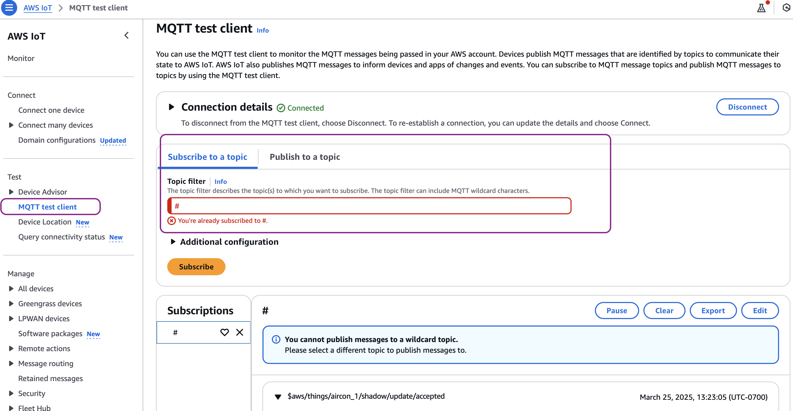
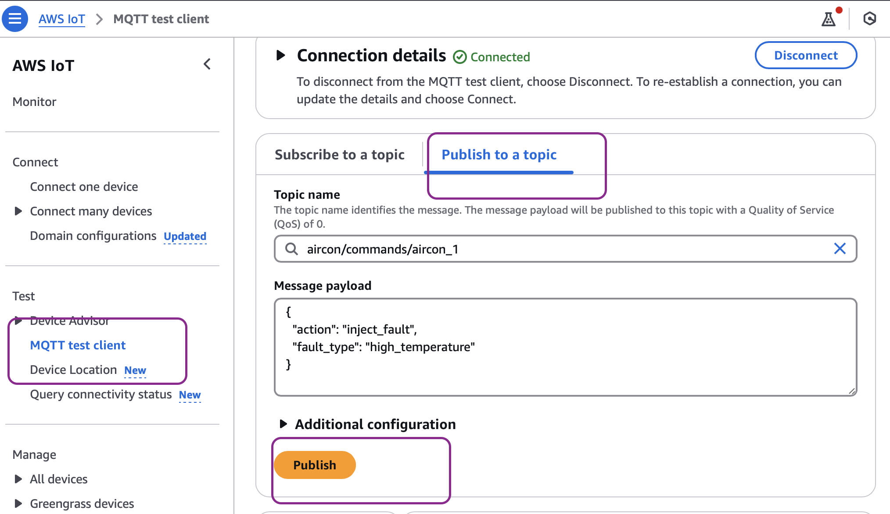

# **Air Conditioner Simulator Project**

## The Air Conditioner Simulator Project is an IoT simulation that models air conditioner units and allows you to monitor and control them via a web dashboard. The project uses AWS IoT Core to simulate device connectivity and messaging.

## Architecture


## Prerequisite

# EC2 Instance Setup Instructions

## Prerequisites

- Active AWS account
- Appropriate IAM permissions to create EC2 instances

## Instance Specifications

- Name: oneCallAirConSimulator
- Type: t2.micro (Free tier eligible)
- AMI: Amazon Linux 2023
- VPC: Default
- Security Group: Allow SSH (port 22)

## Launch Steps

1. **Access EC2 Dashboard**

   - Log into AWS Console
   - Navigate to EC2 service

2. **Launch Instance**

   - Click "Launch Instance" button
   - Enter "oneCallAirConSimulator" as name

3. **Choose AMI**

   - Select "Amazon Linux 2023 AMI"
   - Architecture: x86_64

4. **Instance Configuration**

   - Select t2.micro instance type
   - Create or select existing key pair
   - Keep default network settings
   - Allow SSH traffic in security group

5. **Launch**
   - Review configuration
   - Click "Launch Instance"

## Connecting to Instance

1. Wait for instance state to show "Running"
2. Select instance in EC2 dashboard
3. Click "Connect" button
4. Choose "EC2 Instance Connect" tab
5. Click "Connect" to open browser-based terminal

## Next Steps

After successful connection, proceed with the steps below.

## Steps to Deploy

1. After launching your EC2 instance in the AWS Management Console, create an EC2 Instance Profile Role with S3 and IoT Full Access and attach the role to this EC2 instance.

2. Gp to the running EC2 instance, click the 'Connect' button, choose the 'EC2 Instance Connect' tab, and select 'Connect' to open a browser-based terminal, providing instant, secure access to your instance's command-line interface without the need for SSH keys or additional software."

3. Install necessary libraries by running the following commands.

```
#!/bin/bash

#**Update system packages**
sudo yum update -y

#**Install Git**
sudo yum install git -y

#**Install Python **
sudo yum install python -y

#**Install pip**
sudo yum install pip -y

#**Sync files from S3 bucket (add the name of the name of s3 bucket path here)**
aws s3 sync s3://iot-qnabot-onecall-uuid/deployment/source/ /home/ec2-user/

#**Navigate to simulator directory**
cd /home/ec2-user/iot_simulator

#**Install Python requirements**
pip install -r requirements.txt

#**Graphics library**
sudo yum install mesa-libGL

#Setup complete! You can now create devices and run air_simulator.py

```

To create devices, follow the device creation process:

```
#**Configure the region. Run aws configure, provide the region (example: us-east-1), keep rest of the options as NONE
aws configure

#**Create simulator devices
python create_devices.py  --count 2 --device-prefix aircon
```

To run simulator: python air_simulator.py

3. Start the devices.

```
python aircon_simulator.py
```

4. Go to AWS IoT Console. Click on Domain configurations under Connect in the left menu navigation. Copy the IoT Domain name

5. Inject error. Please see instructions below to inject fault/error.

- Go to the Console. AWS IOT -> MQTT test client -> Subscribe to a Topic -> # . Now you should see the telemetry data.

- Now go to the publish tab, change the Topic name as: aircon/commands/aircon_1 (Please change it to your device name if needed.)

```
Go to the MQTT client
```



```
Publish the message
```



```

Inject Faults

1. High Temperature (Error Code: E1)

{
  "action": "inject_fault",
  "fault_type": "high_temperature"
}
Effect: Increases indoor temperature by 5-10°C


1. Low Pressure (Error Code: E2)

{
  "action": "inject_fault",
  "fault_type": "low_pressure"
}
Effect: Forces refrigerant pressure to minimum level


1. Compressor Failure (Error Code: E3)

{
  "action": "inject_fault",
  "fault_type": "compressor_failure"
}
Effect: Turns off compressor, sets power consumption to 0


```

6. Inject anomaly.

- Now go to the publish tab --> aircon/commands/aircon_1 (Please change it to your device name if needed.)
- Publish command to aircon/commands/aircon_1: {"action": "set_wattage_mode", "wattage_mode": "abnormal"}
- Publish command to aircon/commands/aircon_1: {"action": "set_wattage_mode", "wattage_mode": "normal"}

For detailed explanation for all these steps please see the implememtation guide.
